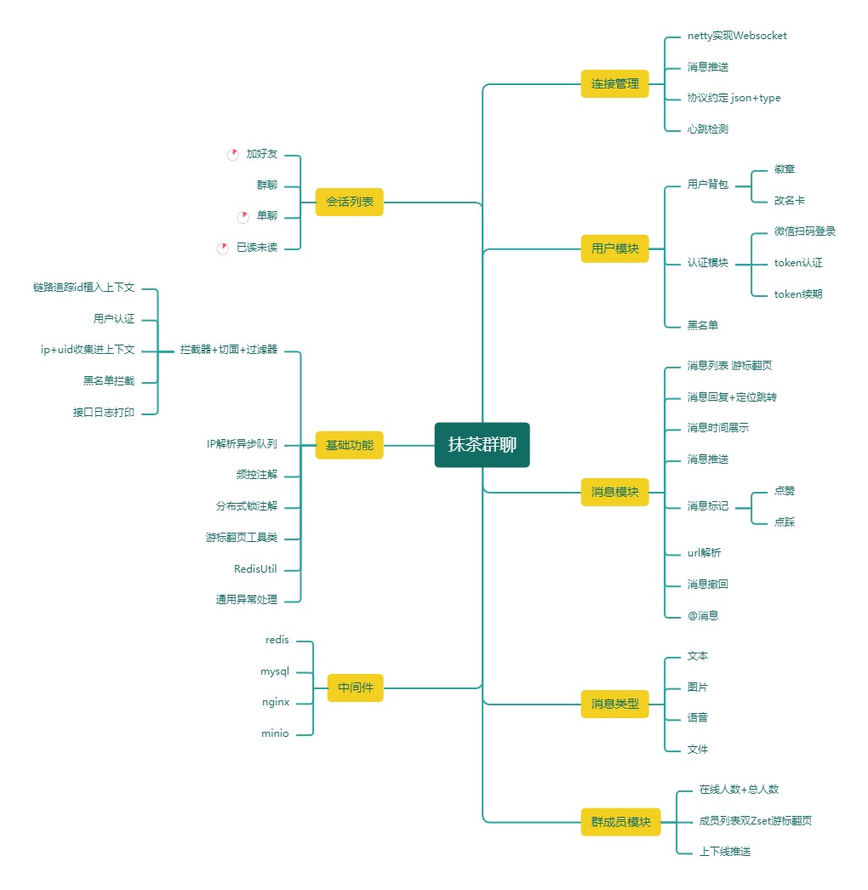
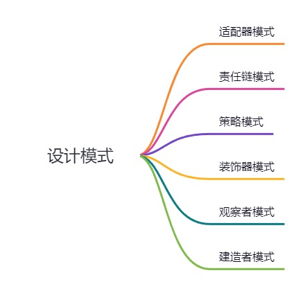
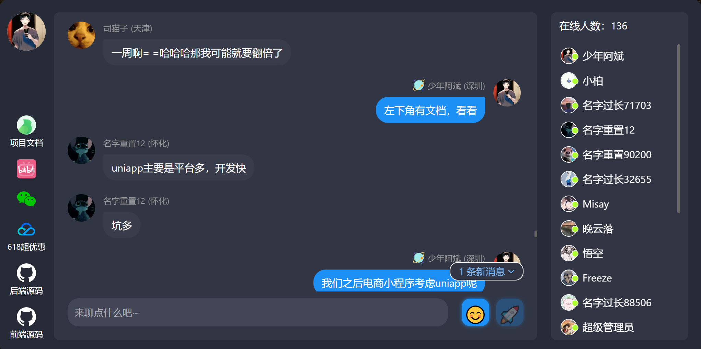
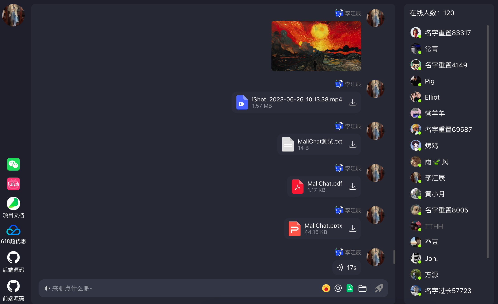
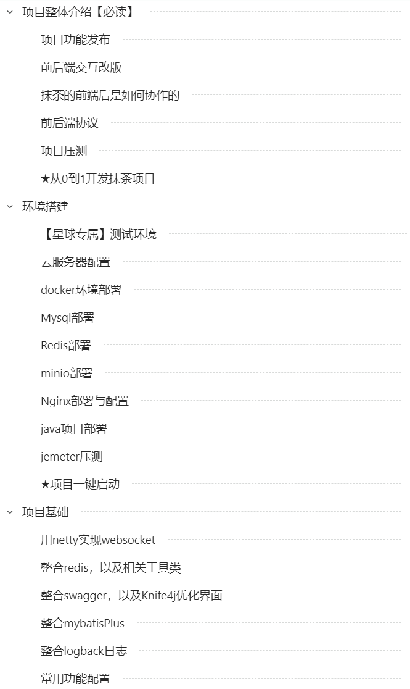
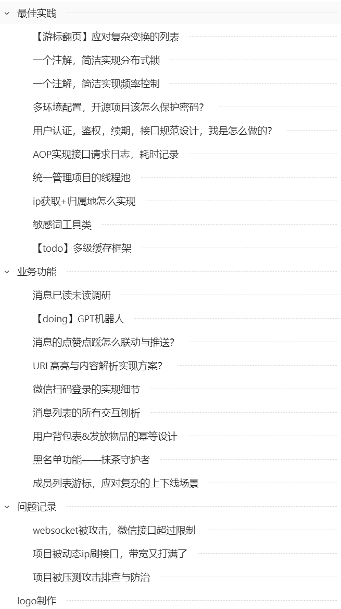

    

<h1 align="center">MallChat-抹茶</h1>

<strong>一个既能购物又能即时聊天的电商系统。致力于打造互联网企业级项目的最佳实践。 电商该有的购物车、订单、支付、推荐、搜索、拉新、促活、推送、物流、客服、它都必须有。<em>持续更新 ing～</em></strong>

 
    
    
    
    
  
    
     
    

## 项目导航

- **快速体验地址**：[抹茶聊天首页](https://mallchat.cn)
- **前端项目仓库**：[MallChatWeb](https://github.com/Evansy/MallChatWeb)
- **项目视频记录**：[Bilibili地址](https://space.bilibili.com/146719540) 全程分享项目进度，功能选型的思考，同时征集迭代建议。
- **项目学习文档**：10w+字，保姆级教学路线，环境搭建、核心功能、基建轮子、接口压测、问题记录、一个不落。可点击[抹茶项目文档](https://www.yuque.com/snab/planet/cef1mcko4fve0ur3)查看（内含500人交流大群）
- **项目交流群**：对抹茶感兴趣的，可以加入[交流群](#公众号)。你的每一个举动，都会决定项目未来的方向。无论是提意见做产品经理，还是找bug做个测试人员，又或者加入开发小模块成为contributer，都欢迎你的加入。
- **码云仓库**：[Gitee](https://gitee.com/zhongzhibinbin/MallChat)（国内访问速度更快）

## 项目介绍

抹茶聊天是一个IM项目，通过netty实现和前端的websocket连接。内含微信扫描登录，成员列表，消息列表，消息互动，丰富的消息类型，还有很多实用的小轮子列如aop日志，分布式锁注解，频控注解，ip解析归属地等，持续更新中。。。

### 项目演示

#### C端项目

- 前端源码地址：[https://github.com/Evansy/MallChatWeb](https://github.com/Evansy/MallChatWeb)
- 项目演示地址：[https://mallchat.cn](https://mallchat.cn) (记住抹茶.cn，下次工作摸鱼可直接打开)

### 技术选型

#### 后端技术

|        技术         | 说明                                       | 官网                                                         |
| :-----------------: | ------------------------------------------ | ------------------------------------------------------------ |
|     SpringBoot      | web开发必备框架                            | [https://spring.io/projects/spring-boot](https://spring.io/projects/spring-boot) |
|       MyBatis       | ORM框架                                    | http://www.mybatis.org/mybatis-3/zh/index.html               |
|     MyBatisPlus     | 零sql，简化数据库操作，分页插件            | [https://baomidou.com/](https://baomidou.com/)               |
|        Redis        | 缓存加速，多数据结构支持业务功能           | [https://redis.io](https://redis.io)                         |
|      Caffeine       | 本地缓存                                   | http://caffe.berkeleyvision.org/                             |
|        Nginx        | 负载均衡，https配置，websocket升级，ip频控 | [https://nginx.org](https://nginx.org)                       |
|       Docker        | 应用容器引擎                               | [https://www.docker.com](https://www.docker.com)             |
|         Oss         | 对象存储                                   | [https://letsencrypt.org/](https://letsencrypt.org/)         |
|         Jwt         | 用户登录，认证方案                         | [https://jwt.io](https://jwt.io)                             |
|       Lombok        | 简化代码                                   | [https://projectlombok.org](https://projectlombok.org)       |
|       Hutool        | Java工具类库                               | https://github.com/looly/hutool                              |
|     Swagger-UI      | API文档生成工具                            | https://github.com/swagger-api/swagger-ui                    |
| Hibernate-validator | 接口校验框架                               | [hibernate.org/validator/](hibernate.org/validator/)         |
|        minio        | 自建对象存储                               | https://github.com/minio/minio                               |

#### 前端技术

前往[MallChatWeb](https://github.com/Evansy/MallChatWeb)查看

### 环境搭建

在项目目录下的`application.yml`修改自己的启动环境`spring.profiles.active` = `test`然后找到同级文件`application-test.properties`，填写自己的环境配置。[星球成员](https://www.yuque.com/snab/planet/cne0nel2hny8eu4i)提供一套测试环境配置，可直连

### 项目文档

保姆级教学路线，涵盖环境搭建、核心功能实现、基础架构构建、接口压力测试、问题记录以及项目的亮点。无一遗漏持续不断地更新中～  
查看[项目文档](https://www.yuque.com/snab/planet/cef1mcko4fve0ur3)

  
  

## star 趋势图

## 贡献
**贡献之前请先阅读[行为准则](CODE_OF_CONDUCT.md) 和 贡献指南。感谢所有为 MallChat 做过贡献的人!**

#### 后端:

  

#### 前端:

<h4>优秀贡献者:</h4>

<table>
  <tr>
    <th>类别</th>
    <th>用户</th>
    <th>贡献模块</th>
  </tr>
  <tr>
    <td rowspan="3">前端</td>
    <td rowspan="3">
      
    </td>
    <td><a href="https://github.com/Evansy/MallChatWeb/pull/74">图片、语音、文件类型消息收发</a></td>
  </tr>
  <tr>
    <td><a href="https://github.com/Evansy/MallChatWeb/pull/50">消息互动操作(撤回、点赞、删除)</a></td>
  </tr>
  <tr>
    <td><a href="https://github.com/Evansy/MallChatWeb/pull/17">虚拟列表</a></td>
  </tr>
  <tr>
    <td rowspan="5">后端</td>
    <td rowspan="2">
      
    </td>
    <td><a href="https://github.com/zongzibinbin/MallChat/pull/31">DFA敏感词检测</a></td>
  </tr>
  <tr>
    <td><a href="https://github.com/zongzibinbin/MallChat/pull/64">OpenAI聊天机器人</a></td>
  </tr>
  <tr>
    <td rowspan="1">
      
    </td>
    <td><a href="https://github.com/zongzibinbin/MallChat/pull/99">Ac自动机敏感词检测</a></td>
  </tr>
    <tr>
    <td rowspan="1">
      
    </td>
    <td><a href="https://github.com/zongzibinbin/MallChat/pull/95">限流编程式</a></td>
  </tr>
    <tr>
    <td rowspan="1">
      
    </td>
    <td><a href="https://github.com/zongzibinbin/MallChat/pull/82">握手认证</a></td>
  </tr>
</table>

## License
[Apache License 2.0](./LICENSE)
## 公众号

微信搜索 **阿斌Java之路** 关注我的原创公众号，后台回复「**抹茶**」即可加入抹茶交流群，一些做过公司万人群聊，高并发的小伙伴都在里面讨论方案。公众号也会经常更新项目相关的文档，等你来撩~~

